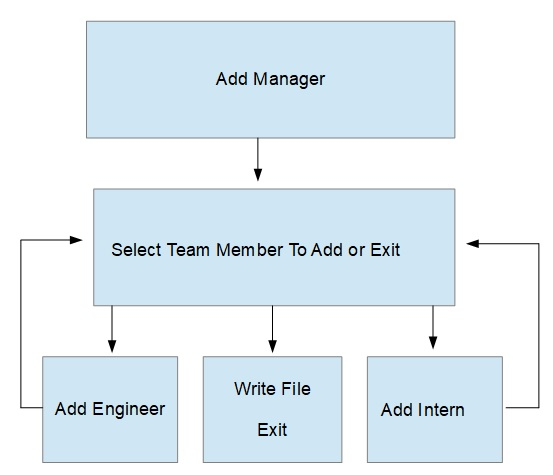

# Team Profile Generator
This repository was created for the Homework Assignment dealing with Object-Oriented Programming.  

Developer: Duane Cantera 
Date: Nov. 20, 2021 
Assignment: #10 - Object-Oriented Programming - Team Profile Generator  

I created two Screencastify recordings because there is a time limit of 5 minutes and it took me longer than 5 minutes to input all of my team members, to run the npm test operation and to test the input entered.
These recordings are stored up on google drive and they are shared and the links to these recordings are listed below.

The file created by the application is called: "generated_index.html"  
Located in the "dist" folder.  

### DESIGN INFORMATION:

The inquirer package was used to ask the user questions and to get the response entered in the console.  The file system module of NODEJS is used to create the HTML file by calling the function writeFile.

The test system Jest was used for unit test development.  I wrote test cases for all of the classes that
were created.  An Employee, Engineer, Intern and Manager.

When the user input is entered I am validating what is entered: 
**First Name** - Only the Characters a-z and A-Z are allowed. 
**id** - Only the numbers 0-9 are allowed. 
**email** - Only an email formatted correctly is allowed. 
**Office Number** - Only the numbers 0-9 are allowed. 
**GitHub Username** - Only the numbers 0-9, the characters a-z and A-Z are allowed. 
**School** - Only the numbers 0-9, the charaters a-z and A-Z and spaces allowed.  

The flow logic of the code is diagramed below:

The Manager is entered and then selects a team member and they are added.  It loops back to the team member selection until the "Exit" option is selected, then the file is written and the program exits.  

### LINKS:

Git Hub Link To Code For Project:  
https://github.com/canterad/Team_Profile_Generator.git

Links to Screencastify recordings on Google Drive: 
https://drive.google.com/file/d/1lKy768L_Nv2VyyzGVOEjwhgUTUplu8R7/view?usp=sharing 
https://drive.google.com/file/d/1jyucNhmVG2E1POM7kv4o9Ca5-SMGXWnA/view?usp=sharing

